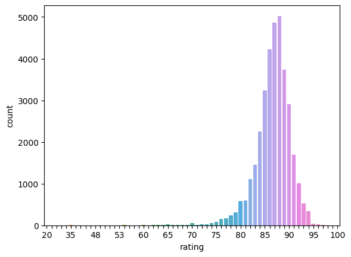
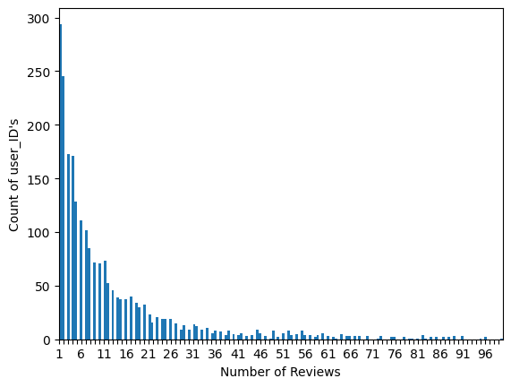

# **BoozePal**
for 
## Overview

Goal of this project is to build **BoozePal** (assistant in choosing) and help to pick best "drink" for you.
Using [Whiskeybase.com](https://www.whiskybase.com) for [top 1000](https://www.whiskybase.com/whiskies/top1000) rated whiskies and [released/bottled in 2022](https://www.whiskybase.com/whiskies/new-releases) to get : user ratings, user names, and the whiskeys to build df for **BoozePal**

*Please see below for how **BoozePal** works.

## Scraper:

[scraper.ipynb](//github.com/7ev3r/Midterm_assignment_v2/blob/742bc3a1980443d46c188bf2093d426414c8c162/scraper.ipynb)

This script does the following tasks:

1. Imports necessary libraries such as requests, pandas, BeautifulSoup, and selenium.
2. Sets up a headless browser with options and user agent.
3. Defines two URLs: one for new whiskey releases in 2022, and another for the top 1000 whiskies.
4. Sends requests to the URLs and parses the HTML using BeautifulSoup.
5. Finds all the anchor tags with a 'clickable' class and extracts their href attributes (links) into two lists.
6. Defines a function get_ratings() that does the following:
7. Logs into the Whiskybase website.
8. Loops through the whiskey links and navigates to the individual whiskey pages.
9. Extracts the price, user names, and ratings.
10. Constructs a list of dictionaries containing the whiskey name, user, rating, price, and URL.
11. Calls the get_ratings() function for both the new releases and top 1000 whiskies.
12. Creates two dataframes from the lists of dictionaries, one for new releases and one for top 1000 whiskies.
13. Exports the dataframes to CSV files: **'Whiskey_Released_in_2022_Data.csv'** and **'Whiskey_Top_1000_Data.csv'**.

Result :  
**Whiskey_Released_in_2022_Data.csv**  
**Whiskey_Top_1000_Data.csv**

## Data clean :

[cleaning_data.ipynb](https://github.com/7ev3r/Midterm_assignment_v2/blob/742bc3a1980443d46c188bf2093d426414c8c162/cleaning_data%20.ipynb)

This script performs the following data cleaning and processing tasks on the two CSV files containing whiskey data ('Whiskey_Released_in_2022_Data.csv' and 'Whiskey_Top_1000_Data.csv'):

1. Imports necessary libraries such as pandas, seaborn, numpy, and re.
2. Reads the two CSV files and stores their contents in dataframes df1 and df2.
3. Adjusts the maximum display width for pandas columns.
4. Concatenates the two dataframes along the row axis (axis=0) and stores the result in df.
5. Drops the 'Unnamed: 0' column, which is an unnecessary index column.
6. Filters the dataframe to keep only users who have more than 5 reviews, resulting in a new dataframe df5.
7. Drops any rows with missing data (NaN) in df5.
8. Creates a new 'User_ID' column in df5 that assigns a unique ID to each user while keeping the user name hidden.
9. Creates a new 'Whiskey_ID' column in df5 that assigns a unique ID to each whiskey.
10. Drops the 'user' column from df5, as it is no longer needed after creating the 'User_ID' column.
11. Drops any duplicate rows in df5.
12. Cleans the 'price' column by removing the currency sign (€) and converting the values to float, then stores the result in a new column 'price_euros'.
13. Drops the original 'price' column from df5.
14. Exports the cleaned dataframe to a new CSV file, 'Clean_whiskey_data.csv'.
After running this script, we have a cleaned and processed version of the whiskey data in 'Clean_whiskey_data.csv', which can be used for further analysis or visualization.

Result :  
**Clean_whiskey_data.csv**

Mostly with only highly rated whiskeys

*looks good , moving forward

## Running local MySQL server and uploading data from .csv to created db

Checking with MySQL Workbech table content

*looks good , moving forward

## Connecting to local MySQL server and getting data from db

[connect_to_db.ipynb](https://github.com/7ev3r/Midterm_assignment_v2/blob/956eae7ea01389d105892228d439c7204b0cece5/connect_to_db.ipynb)

## Initial EDA

[EDA.ipynb](https://github.com/7ev3r/Midterm_assignment_v2/blob/742bc3a1980443d46c188bf2093d426414c8c162/EDA.ipynb)

In this script, we are loading the cleaned whiskey data from 'Clean_whiskey_data.csv' and using Seaborn to create various visualizations to analyze the dataset. Below is a summary of each step in the script:

1. Import the necessary libraries: pandas and seaborn.
2. Read the 'Clean_whiskey_data.csv' file and store it in a DataFrame df.
3. Drop the 'Unnamed: 0' column, which is an unnecessary index column.
4. Print the total number of reviews, unique users, and unique whiskey IDs in the dataset.

*dataframe has : 
Reviews : 33304  
Unique Users count : 2519  
Unique Whiskey_ID's : 2294

6. Display a random sample of 5 rows from the DataFrame.

8. Create a countplot of the 'rating' column, showing the distribution of ratings.

10. Create a countplot of the 'User_ID' column, showing the distribution of user review counts.

12. Create a histogram of the number of reviews per whiskey, with a bin size of 500.

14. Create a histogram of the number of reviews per user, with a bin size of 500.

16. Create a countplot of the 'price_euros' column, showing the distribution of whiskey prices.

The script generates a number of plots that provide insights into the whiskey data. For example, we can see that most whiskies have high ratings, ranging from the mid-80s to 100. This is because the dataset mostly consists of top-rated whiskies.

Additionally, the plots show that most users have reviewed many different types of whiskies, and the histograms for the number of reviews per whiskey and per user give a sense of how the data is distributed.

Lastly, the countplot for the 'price_euros' column shows the distribution of whiskey prices in the dataset, allowing you to see how prices vary across different whiskies.

## Initial Models

Using [Google Colab](https://colab.research.google.com/drive/1D_bPgani_4glpsPrahdqbd-BbIJcDeaR?usp=sharing) notebook :

[Train_ML_model_new.ipynb](Train_ML_model_new.ipynb)

*somehow cant use Surprise as Python scikit for building and analyzing recommender systems that deal with explicit rating data in VS Code

This code provides a whiskey recommendation system called BoozePal. It's based on the Collaborative Filtering technique using the Surprise library for recommender systems. The code reads a dataset of whiskey ratings and prices, and then it prompts user to rate a few randomly-selected whiskies. Based on these ratings and the user's budget, BoozePal provides personalized whiskey recommendations.

Here is a brief explanation of the main sections in the code:

1. Import necessary libraries and read the whiskey dataset.
2. Preprocess the dataset to obtain the necessary columns for the recommendation system.
3. Test the SVD algorithm from the Surprise library on a train-test split and calculate the root-mean-square error (RMSE).
4. creating a custom cross-validation function custom_cross_validate to store the RMSE values for each fold in the cross-validation process. Then, it plots the accuracy (RMSE) curve for the validation set across the folds, along with the mean RMSE.

6. Define the test_pal function to test the prediction of a single user-item rating.
7. Define the find_booze function to find whiskey recommendations based on the user's input ratings and budget.
8. Define the BoozePal function, which prompts the user for the number of recommendations, budget, and whiskey ratings, then calls the find_booze function to provide personalized recommendations.
9. Call the BoozePal function with the dataset and the number of whiskies the user should rate.

In the provided example, the user rates 5 whiskies and asks for 5 recommendations with a budget of 80 euros. The system then provides 5 personalized whiskey recommendations based on the user's preferences and budget.

## Conclusion

- **BoozePal** whiskey recommendation system provides personalized whiskey suggestions based on user preferences and budget. It leverages collaborative filtering techniques and the Surprise library to make predictions on user-item ratings. The system prompts users to rate a few whiskies and input their budget, then it offers recommendations tailored to their preferences within their specified price range. This solution can be valuable for whiskey enthusiasts looking for new bottles to try or for those who want to find a suitable gift for a whiskey lover within a certain budget. It demonstrates the practical application of recommender systems in the context of the whiskey market.
- **BoozePal** also provides URL links to give additional information , in case you decide to get more detailed information about recomendet drink.
